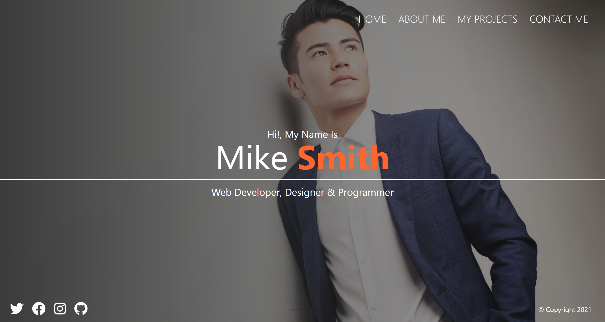

# Getting started with Sass

This is a project built with HTML, Sass and JavaScript, is about the someone's portfolio website, implementing all the features that sass provide.

## Table of contents

- [Overview](#overview)
  - [The project](#the-project)
  - [Screenshot](#screenshot)
  - [Links](#links)
- [My process](#my-process)
  - [Built with](#built-with)
  - [What I learned](#what-i-learned)
  - [Useful resources](#useful-resources)
- [Author](#author)

## Overview

### The project

Users should be able to:

- See a website built with Sass

### Screenshot

### Links

- Solution URL: [Solution URL here](https://github.com/ncondes/getting-started-with-sassp)
- Live Site URL: [Live site URL here](https://ncondes.github.io/sass-portfolio/dist/html/)

## My process

### Built with

- Semantic HTML5 markup
- CSS custom properties
- Mobile-first workflow
- Sass

### What I learned and put into practice

- Work with Sass
- Mixins
- Functions
- Media Queries
- Nesting
- Variables

### Useful resources

- [Sass](https://sass-lang.com/) - Sass Documentation.

## Author

- Website - [Nicolas Conde Salazar](https://www.ncondes.com)
- Linkedin - [Nicolas Conde Salazar](https://www.linkedin.com/in/ncondes/)
